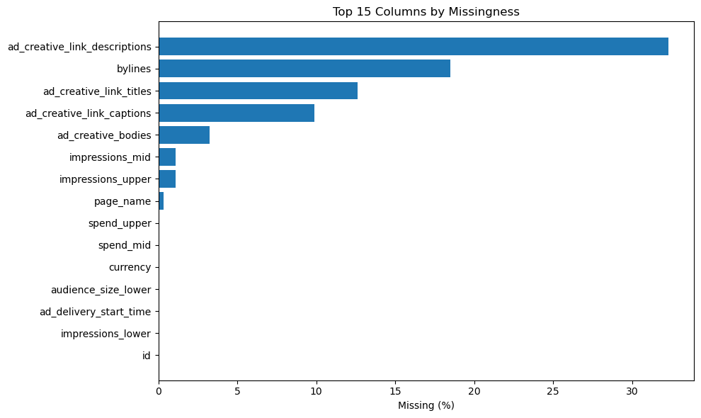
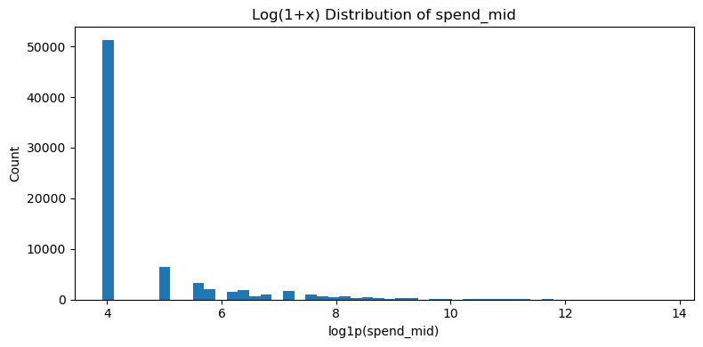
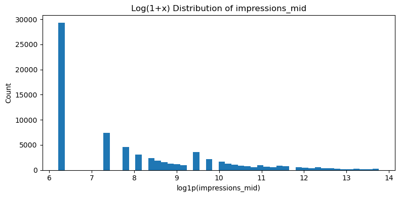
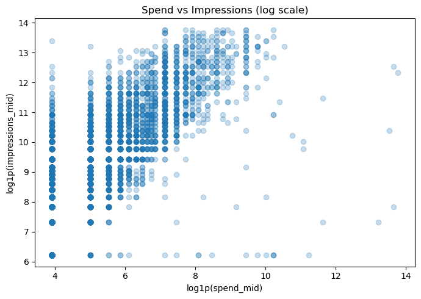
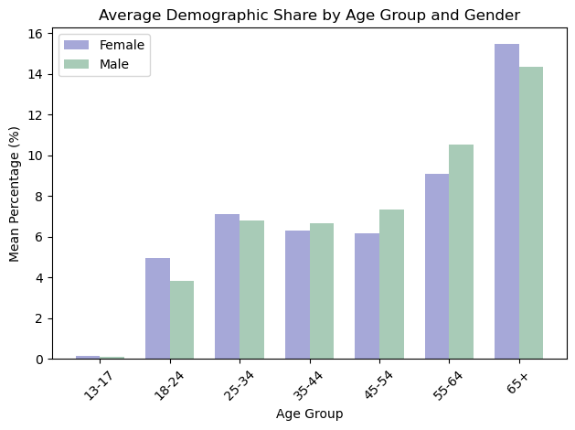
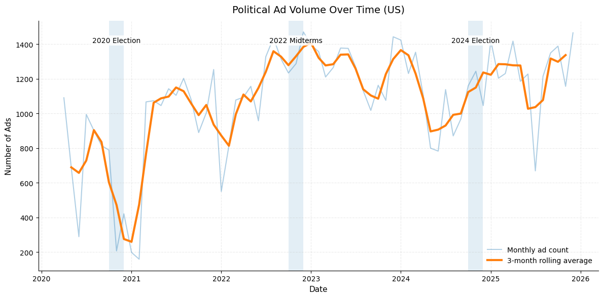

# MATH 189 Final Project

## Description
Social media now serves as the medium through which most individuals access the news and obtain new information, making it a common and effective channel for political advertising. As these platforms become increasingly saturated with content, it is vital that both activists and politicians are strategic about their marketing methods. It’s of the utmost importance to identify a target demographic in order to know which language and buzzwords will be the most engaging and thus, have the highest returns. By analyzing how political advertisements and target audiences change over time, we can better learn how to create an impactful and eye-catching ad. 

When a campaign chooses a particular buzzword, they’re not just picking any term. Instead, they’re trying to signal an identity or a set of values that resonates with a specific group of people. This project will help us see how word choices have evolved over time as well as provide insights into the political climate and its development over time too. In this way, we can better comprehend how digital spaces are being used to influence anything from smaller social movements to major elections. Such insights also promote greater awareness of marketing strategies enabling us to make better informed decisions that are less influenced by campaign strategy.

Thus, we want to investigate the following questions:

Do the buzzwords utilized by political ads on Facebook remain stable from 2019 to the present? Additionally, does that trend remain the same for all demographics or do ads targeting different demographics exhibit different patterns in how much the buzzwords they use change over time?

## Column Metadata
| Column | Type | Description |
|---|---|---|
| `id` | int | Unique identifier for the ad |
| `ad_creation_time` | datetime | When the ad was created |
| `ad_delivery_start_time` | datetime | When the ad began delivery |
| `bylines` | string | Attribution/byline for the ad |
| `currency` | string | Currency used for spend values |
| `page_id` | int | Unique identifier for the Facebook page |
| `page_name` | string | Name of the Facebook page |
| `ad_creative_bodies` | string | Main body text of the ad creative |
| `ad_creative_link_captions` | string | Caption text for linked content |
| `ad_creative_link_descriptions` | string | Description text for linked content |
| `ad_creative_link_titles` | string | Title text for linked content |
| `audience_size_lower` | int | Lower bound of estimated audience size |
| `impressions_lower` | int | Lower bound of ad impressions |
| `impressions_upper` | float | Upper bound of ad impressions |
| `spend_lower` | int | Lower bound of amount spent |
| `spend_upper` | float | Upper bound of amount spent |
| `ad_snapshot_url` | string | URL to the ad snapshot |
| `language_<lang>` | bool | Whether the ad contained <lang> as a language |
| `platform_<pf>` | bool | Whether the ad was on <pf> |
| `<age range>/<gender>` | float | Percentage (%) of <age range> and <gender> demographic in the audience |

## Exploratory Data Analysis

### Dataset overview
The dataset contains approximately 74,000 political ads and 47 original variables. Each row represents a single ad and includes ad metadata, delivery timing, estimated impressions and spend ranges, language and platform indicators, and demographic audience-share fields.

To support interpretation during EDA, I created several derived features:
- `impressions_mid`: midpoint of `impressions_lower` and `impressions_upper`
- `spend_mid`: midpoint of `spend_lower` and `spend_upper`
- `delivery_lag_days`: days between ad creation and ad delivery start
- `delivery_month`: month of ad delivery for time-series aggregation
- `demo_sum`: row-wise sum of demographic audience shares
- `demo_complete`: indicator for whether demographic shares sum to approximately 100

These engineered features made it easier to evaluate data quality, summarize skewed variables, and interpret patterns in ad delivery and targeting.

### Missingness and data quality
The first step in EDA was to assess missing values and determine whether they affected core analysis variables.

The most noticeable missingness occurs in creative text fields, especially:
- `ad_creative_link_descriptions`
- `bylines`
- `ad_creative_link_titles`
- `ad_creative_link_captions`
- `ad_creative_bodies`

By contrast, the core delivery variables such as estimated impressions and spend are almost entirely complete. This suggests that the missingness is concentrated in optional creative metadata rather than in the primary variables needed for performance analysis.

A second issue appears in the demographic share columns. For about 15% of rows, the age/gender shares do not sum to 100. However, these rows are associated with ads that have zero impressions and zero spend, which suggests they likely correspond to inactive or non-delivered ads rather than random missingness. Because of this, demographic analyses were restricted to rows where the demographic shares summed to approximately 100.

### Missingness across variables

*Missingness is concentrated in optional creative text fields, while core delivery variables remain largely complete.*

### Outliers, skew, and nuisance variables
The numerical delivery variables are strongly right-skewed.

Both `spend_mid` and `impressions_mid` show a long upper tail: most ads have relatively small estimated spend and reach, while a small number of campaigns account for extremely large values. This means that raw averages can be misleading, so I relied more on medians, percentiles, and log-scaled plots to understand the data distribution.

I also found evidence that some variables are capped. In particular, `audience_size_lower` is nearly constant at an upper threshold for almost all rows, which makes it uninformative as a continuous variable. Because of that, I excluded it from interpretation as a meaningful continuous predictor.

Similarly, identifier and snapshot fields such as `id`, `page_id`, `page_name`, and `ad_snapshot_url` are useful for referencing records but do not carry much analytical value for EDA or modeling.

### Spend distribution

*Estimated spend is highly right-skewed, with many small ads and a relatively small number of very large campaigns.*

### Impressions distribution

*Estimated impressions follow a similar long-tailed pattern, indicating that a few high-reach ads dominate the upper tail.*

### Key relationships
The strongest relationship in the dataset is between spend and impressions. Ads with higher estimated spend generally receive more impressions, but the relationship is not linear. A rank-based view is more informative than a raw linear one because the data is heavily skewed and includes capped upper-end values.

Another important pattern appears in audience composition. When demographic shares are restricted to valid rows, the average targeting distribution is concentrated in older age groups, particularly 55–64 and 65+. By contrast, the youngest age groups account for only a very small share of ad targeting.

Monthly ad counts show some increases around major election periods, particularly in 2022 and 2024, suggesting a temporal relationship between ad activity and election cycles.

### Spend vs. impressions

*Higher-spend ads generally receive more impressions, although the relationship is nonlinear and shaped by a long right tail.*

### Audience age composition

*Ad targeting is concentrated in older audiences, especially the 55–64 and 65+ groups.*

### Ad volume over time

*Political ad activity increases around major election periods, with noticeable spikes during election cycles.*

### How EDA informed preprocessing
The EDA led to several concrete handling decisions:

- Creative text fields with substantial missingness were treated as optional metadata rather than core numeric analysis variables.
- Rows with incomplete demographic-share totals were excluded from demographic audience analyses.
- Midpoint variables (`impressions_mid`, `spend_mid`) were created from lower and upper bounds to make summaries and visualizations easier to interpret.
- `audience_size_lower` was treated as a nuisance variable because it was nearly constant and likely top-coded.
- Log-scaled visualizations were used for spend and impressions because raw-scale plots were dominated by extreme values.

Overall, the EDA showed that the dataset is strong for analyzing ad delivery scale, audience targeting, and temporal patterns, but weaker for analyses that depend heavily on complete creative text metadata.
